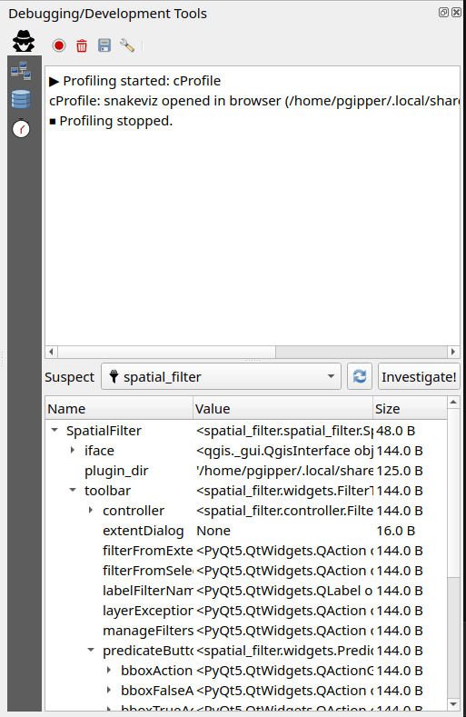
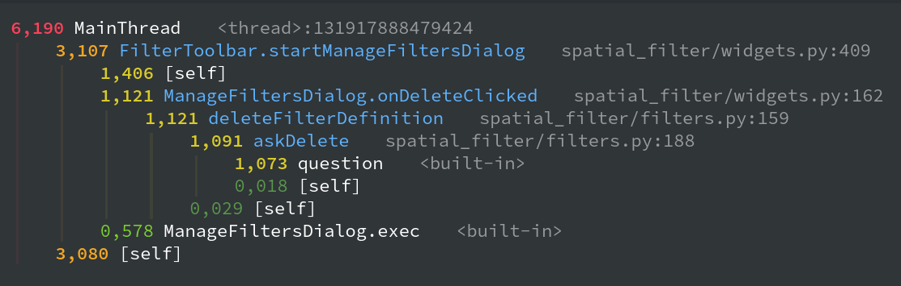
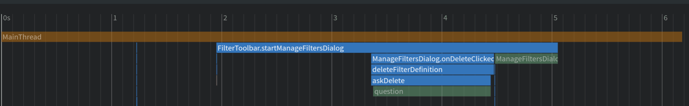
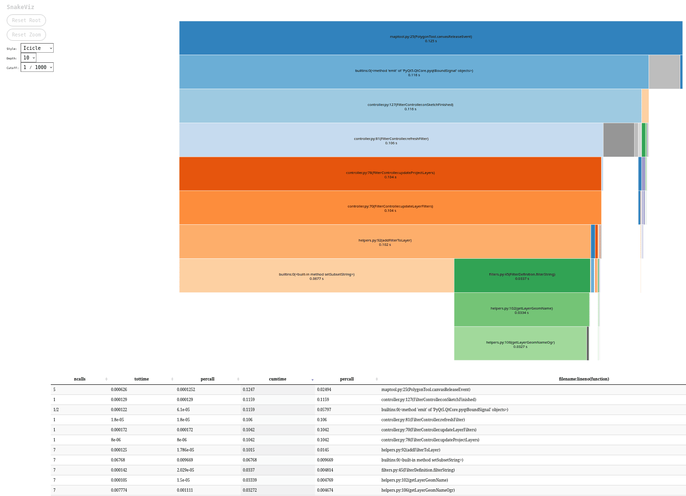
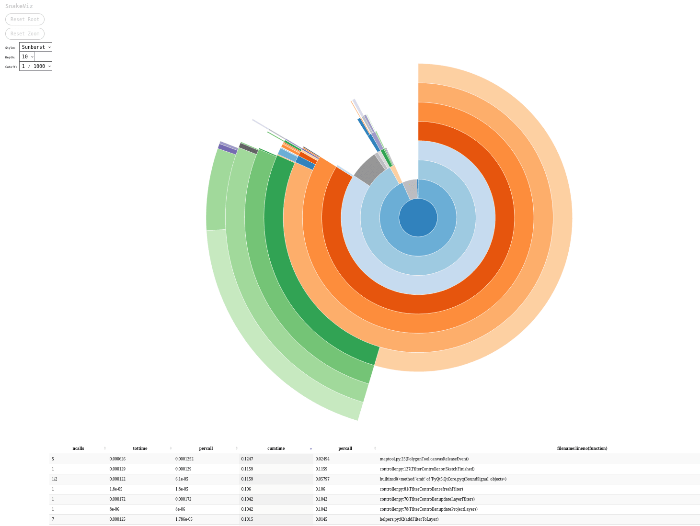
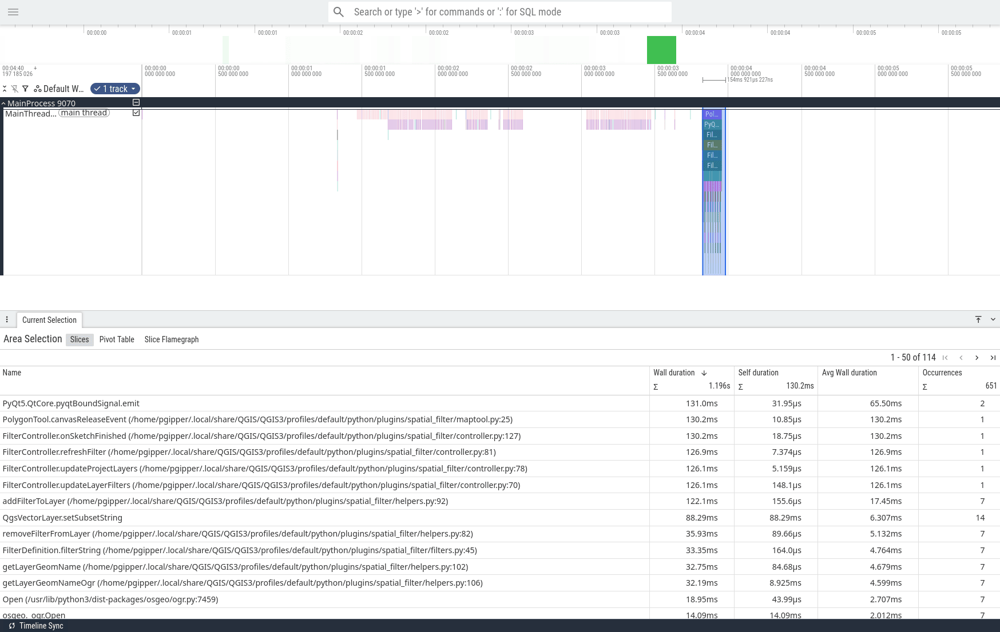
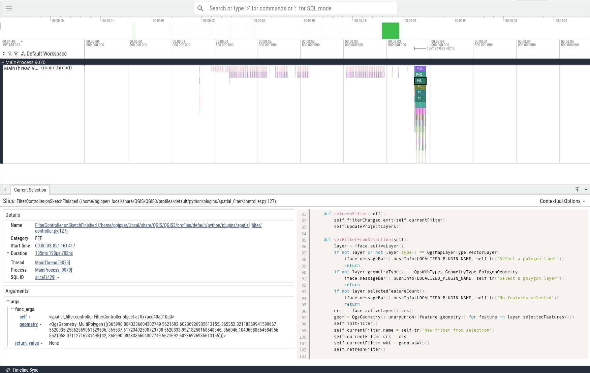

# QGIS Plugin Inspector 

Get some info about registered plugins in the current profile

For now its just experiments.

## General

Open the plugin inspector via the dev tools panel (F12). 

## Profiling

Plugin Inspector ships with multiple profiler backends. Toggle profiling with the
**Profiler** button in the toolbar, then stop it to collect and view the results.
Enable or disable individual profilers via the **Settings** action.

Most profilers and interactive vizualisation tools have to be installed manually

    pip install pyinstrument snakeviz yappi viztracer

When multiple profilers are active at the same time, they will profile each other. Running more than one profiler simultaneously is **not recommended**.

### pyinstrument — Statistical Profiler

| | |
|---|---|
| **Type** | Statistical (sampling) |
| **Install** | `pip install pyinstrument` |
| **Output** | Interactive HTML report opened in browser |
| **Visualization** | Built-in HTML renderer |
| **Docs** | [pyinstrument.readthedocs.io](https://pyinstrument.readthedocs.io) |

pyinstrument samples the call stack at regular intervals rather than tracing
every function call. This makes it lightweight with low overhead and ideal for
getting a quick, high-level view of where time is spent. Because it samples
rather than traces, short-lived calls may be missed — but the overall picture
is usually accurate and easy to read.

<table><tr>
<td></td>
<td></td>
</tr></table>

### cProfile — Deterministic Profiler

| | |
|---|---|
| **Type** | Deterministic (tracing) |
| **Install** | Built-in (Python standard library) |
| **Optional** | `pip install snakeviz` for interactive visualization |
| **Output** | `.prof` and `.txt` files; snakeviz browser UI if available |
| **Visualization** | [snakeviz](https://jiffyclub.github.io/snakeviz/) (sunburst / icicle) |
| **Docs** | [docs.python.org/3/library/profile.html](https://docs.python.org/3/library/profile.html) |

cProfile is Python's built-in deterministic profiler. It records every function
call and return, giving exact call counts and cumulative timings. The trade-off
is higher overhead compared to statistical profilers. When snakeviz is installed
it opens an interactive sunburst visualization in the browser; otherwise a text
summary is shown.

### yappi — Thread-Aware Profiler

| | |
|---|---|
| **Type** | Deterministic (tracing), multi-threaded |
| **Install** | `pip install yappi` |
| **Optional** | `pip install snakeviz` for interactive visualization |
| **Output** | pstat-compatible `.prof` and human-readable `.txt`; snakeviz browser UI if available |
| **Visualization** | [snakeviz](https://jiffyclub.github.io/snakeviz/) (sunburst / icicle) |
| **Docs** | [github.com/sumerc/yappi](https://github.com/sumerc/yappi) |

yappi profiles **all threads**, not just the main thread, and supports both
wall-clock and CPU-time modes. In wall-time mode it captures everything that
happens during nested event loops (e.g. `QDialog.exec()`), making it
particularly useful for understanding what QGIS does while a modal dialog is
open.

<table><tr>
<td></td>
<td></td>
</tr></table>

### viztracer — Timeline Tracer

| | |
|---|---|
| **Type** | Full call-stack timeline tracer |
| **Install** | `pip install viztracer` |
| **Output** | JSON trace file; interactive timeline via vizviewer |
| **Visualization** | [vizviewer](https://viztracer.readthedocs.io) (Perfetto-based timeline) |
| **Docs** | [viztracer.readthedocs.io](https://viztracer.readthedocs.io) |

viztracer records every function call chronologically across all threads and
renders the result as an interactive timeline. This is the most detailed view
available — ideal for understanding ordering, concurrency, and nested
event-loop behaviour. The downside is significantly higher overhead and larger
output files. Many aspects of the trace can be tuned in the profiler settings
(stack depth, argument logging, minimum duration filter, etc.).

<table><tr>
<td></td>
<td></td>
</tr></table>
